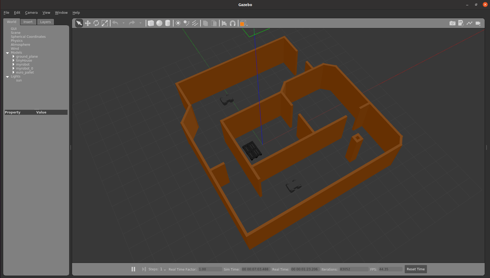

# Build My Robot
The **Build My Robot** project is the first project that comes in **Gazebo World** lesson in Robotics Software Engineer Nanodegree Program. The purpose is to learn how to build a world with custom designed models and pre installed models in Gazebo. This project also has a plugin that welcomes at the begining of the simulation execution.

### Directory Structure
```
    .BuildMyWorld                      # Project main folder 
    ├── model                          # Model files used in the world
    │   ├── myrobot
    │   │   ├── model.config
    │   │   ├── model.sdf
    │   ├── tinyHouse
    │   │   ├── model.config
    │   │   ├── model.sdf
    ├── script                         # Gazebo plugin C++ script      
    │   ├── welcome_message.cpp
    ├── world                          # Gazebo main world
    │   ├── myFirstRosWorld.world
    ├── CMakeLists.txt                 # Link libraries 
    └── myFirstRosWorld.png	       # Output Image                           
```

### Steps to launch the simulation

#### Step 1 | Update and upgrade the workspace
```sh
$ sudo apt-get update && sudo apt-get upgrade -y
```
#### Step 2 | Clone the project
```sh
$ cd /home/workspace/
$ git clone https://github.com/CetinFurkan/BuildMyWorld
```

#### Step 3 | Compile the code
```sh
$ cd /home/workspace/BuildMyWorld/
$ mkdir build
$ cd build/
$ cmake ../
$ make
```

#### Step 4 | Add the library path to the Gazebo plugin path  
```sh
$ export GAZEBO_PLUGIN_PATH=${GAZEBO_PLUGIN_PATH}:/home/workspace/BuildMyWorld/build
```

#### Step 5 | Run the Gazebo World file  
```sh
$ cd /home/workspace/BuildMyWorld/world/
$ gazebo myFirstRosWorld
```
